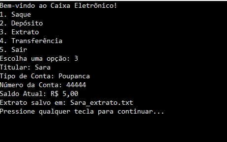

# CaixaEletronico

## O que foi utilizado:

- ***Linguagem de programação:*** C#

- ***Ambiente de desenvolvimento:*** Virtual Studio Code

## Etapas implementadas:

***1. Entrada de dados do usuário:*** O programa solicita ao usuário o nome do titular da conta, o tipo de conta, a senha e o número da conta.

***2. Autenticação:*** Para acessar as operações, o usuário precisa fornecer a senha correta.

***3. Operações bancárias:***

Saque: Verifica se há saldo suficiente e se o valor é válido antes de efetuar a operação.

Depósito: Permite ao usuário depositar um valor positivo na conta.

Extrato: Exibe o extrato bancário com o saldo atual e salva em um arquivo de texto.

Transferência: Simula uma transferência de valores para outra conta.

***4. Fluxo de controle:*** Menu principal com opções de operações e controle de fluxo, permitindo que o usuário continue ou encerre o programa.

## Backlog (Possíveis melhorias):

Validação mais robusta: Implementar mais verificações, como se o número da conta é válido.

Criação de múltiplas contas: Permitir ao usuário criar mais de uma conta no mesmo programa.

Histórico de transações: Adicionar um log de operações realizadas, como saques, depósitos e transferências.

Melhoria na segurança: Implementar criptografia de senhas e autenticação multifator.

Interface gráfica (GUI): Adicionar uma interface gráfica para melhorar a usabilidade do sistema.

## Conclusão:

O código implementa um sistema básico de operações bancárias, incluindo saque, depósito, extrato e transferência. Além disso, permite salvar o extrato em um arquivo de texto. Há potencial para melhorias na segurança, usabilidade e funcionalidades extras.
